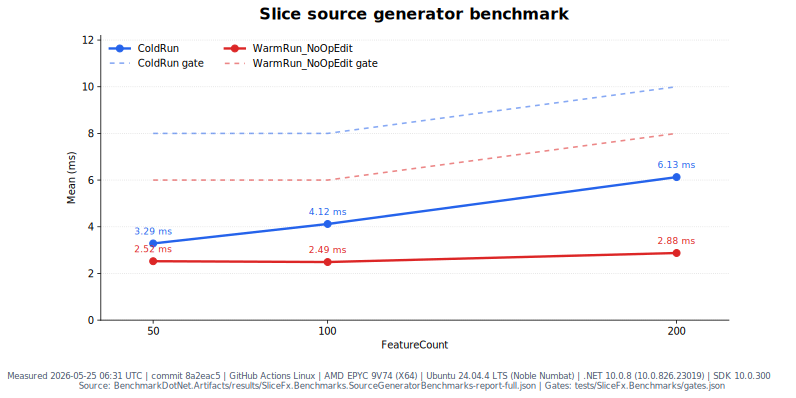

# SliceFx

[](https://github.com/sano-suguru/slicefx/actions/workflows/ci.yml)
[](https://github.com/sano-suguru/slicefx/actions/workflows/perf.yml)
[](https://github.com/sano-suguru/slicefx/actions/workflows/pages.yml)
[](https://dotnet.microsoft.com/)
[](LICENSE)

> One feature file per endpoint. Generated ASP.NET Core registration, checks, clients, and portability hints.

Website: <https://sano-suguru.github.io/slicefx/>

**SliceFx** is an experimental .NET framework for teams that like ASP.NET Core Minimal APIs but do not want route strings, DTOs, validation, filters, clients, and deployment checks to drift apart. A feature is one static class with its request, response, handler, validation, and filters in one place. The generator emits standard Minimal API registrations plus a route manifest for tooling, AOT-friendly startup, Lambda experiments, and WASI/WebAssembly dispatch.

Curious about the design choices? See **[Design decisions FAQ](docs/design-decisions.md)** and **[Production readiness criteria](docs/production-readiness.md)**.

## Why use SliceFx?

| Need | SliceFx provides |
| --- | --- |
| Endpoint code that is easy to review | One feature file per endpoint: request, response, handler, validation, and filters stay together. |
| Less hand-synced API glue | `AddSlice()` / `MapSlices()`, route metadata, and typed clients are generated from the same feature definitions. |
| Standard ASP.NET Core behavior | Minimal API binding, DI, endpoint filters, DataAnnotations, OpenAPI compatibility, and `IResult` remain available. |
| Native AOT-friendly startup | Generated `MapMethods` calls avoid startup route scanning; `SliceFx.Core` has no `PackageReference` entries and only uses the `Microsoft.AspNetCore.App` framework reference. |
| Early portability feedback | `slicefx routes` classifies each endpoint as `portable`, `partial`, or `aspnet-only`; Lambda and wasi:http adapters are optional. |

SliceFx is not a replacement for ASP.NET Core. It is a generated vertical-slice layer around Minimal APIs for teams that want explicit feature files, generated contracts, and portability checks without adopting a mediator stack or custom endpoint pipeline.

SliceFx compiles down to standard `WebApplication.MapMethods` calls — removing the source generator reference and expanding the generated output in place is the full exit path. For teams already on FastEndpoints or similar, SliceFx fills a different niche: compile-time portability classification across ASP.NET, Lambda, and wasi:http, not a richer filter and pipeline ecosystem.

Existing ASP.NET Core apps do not need a rewrite. Start with one endpoint, keep the rest of the app on controllers or handwritten Minimal APIs, and use the migration audit plus contract checks to evaluate the shape. See [migrating from Minimal APIs](docs/migrations/from-minimal-api.md) and [migrating from controllers](docs/migrations/from-controllers.md).

### Latest benchmark results



Each endpoint is a static feature file: request, response, validation, filters, and handler stay together. The source generator turns those features into ASP.NET registrations, route metadata for tooling, Lambda handlers, or wasi:http dispatch where the handler shape is portable.

```bash
dotnet run --project samples/SliceFx.Sample
curl http://localhost:5099/health
```

## Project status

SliceFx is pre-1.0 experimental software. Preview packages use `0.x` versions until the API is intentionally stabilized.

**Release status:** `0.1.0-preview.1` is still unreleased and is not available on NuGet yet. Until the release checklist, local verification, smoke tests, and final NuGet publish are complete, use the repository samples or local project references from a checkout instead of `dotnet add package`.

**SDK and analyzer policy:** the repository targets .NET 10 with SDK `10.0.300` pinned in `global.json` and `rollForward: latestFeature`. Warnings and code-analysis diagnostics are treated as errors, but the analyzer recommendation set is pinned to `10.0-recommended` so normal PR/main builds do not unexpectedly break when a newer SDK promotes analyzer rules. A separate analyzer canary workflow checks the latest .NET 10 analyzer behavior and reports drift for dedicated maintenance PRs.

WASI support (`SliceFx.Wasi`) is experimental and depends on an unstable upstream toolchain: [componentize-dotnet](https://github.com/bytecodealliance/componentize-dotnet), NativeAOT-LLVM preview packages, WASI Preview 2 / `wasi:http@0.2`, and Cloudflare's JS transpile/shim path when targeting Workers. Native WASI publish requires Linux x64 or Windows x64; macOS requires a Linux x64 Docker cross-build. "Experimental" means SliceFx.Wasi's own 0.x API may change; "unstable upstream toolchain" means those external build and deployment tools may break independently of SliceFx runtime code.

| Package | Purpose |
| --- | --- |
| `SliceFx.Core` | Core runtime: `[Feature]`, `[Filter<T>]`, validation, and endpoint filters. |
| `SliceFx.SourceGenerator` | AOT-friendly generated registrations and route metadata. |
| `SliceFx.Lambda` | ASP.NET-hosted AWS Lambda adapter. |
| `SliceFx.Lambda.FunctionPerFeature` | Experimental HTTP API v2 function-per-feature Lambda handlers. |
| `SliceFx.TestHost` | In-process test host helpers. |
| `SliceFx.Wasi` | ASP.NET-independent wasi:http dispatch. |
| `SliceFx.Cli` | Scaffolding, route inspection, AWS SAM manifest/package helpers, and typed client generation. |

After the first preview is published, minimal ASP.NET Core apps will add `SliceFx.Core` and `SliceFx.SourceGenerator` at the same preview version. Those package install commands are intentionally omitted until the NuGet package pages exist.

## Hello, SliceFx

`Program.cs`:

```csharp
var builder = WebApplication.CreateSlimBuilder(args);

builder.Services.AddSlice();
builder.Services.AddSingleton<IUserStore, InMemoryUserStore>();

var app = builder.Build();

app.MapSlices();
app.Run();
```

`Features/Users/CreateUser.cs`:

```csharp
namespace SliceFx.Sample.Features.Users;

[Feature("POST /users", Summary = "Create a new user")]
public static class CreateUser
{
    public record Request(
        [Required, MinLength(2)] string Name,
        [Required, EmailAddress] string Email);

    public record Response(Guid Id, string Name, string Email, DateTime CreatedAt);

    public static async Task<Response> Handle(Request req, IUserStore store, CancellationToken ct)
    {
        var user = await store.AddAsync(req.Name, req.Email, ct);
        return new Response(user.Id, user.Name, user.Email, user.CreatedAt);
    }
}
```

The generator discovers `[Feature]` classes, emits `AddSlice()` / `MapSlices()`, wires Minimal API binding, and attaches validation. Prefer plain response records for portable endpoints. Use `IResult` when the feature intentionally needs ASP.NET-specific response helpers such as `Results.NotFound()` or `Results.NoContent()`.

## Filters and validation

Feature filters are standard ASP.NET Core `IEndpointFilter` types:

```csharp
[Feature("DELETE /users/{id:guid}", Summary = "Delete a user")]
[Filter<RequestLoggingFilter>]
[Filter<RequireApiKeyFilter>]
public static class DeleteUser
{
    public static async Task<IResult> Handle(Guid id, IUserStore store, CancellationToken ct)
    {
        var user = await store.GetAsync(id, ct);
        if (user is null) return Results.NotFound();
        await store.RemoveAsync(id, ct);
        return Results.NoContent();
    }
}
```

`AddSlice()` registers referenced filters and matching validators as scoped services, and `[Filter<T>]` applies filters in declaration order. Supported DataAnnotations rules are generated and run first; closed `ISliceValidator<TRequest>` implementations are discovered when `TRequest` is a Slice request parameter and run automatically before feature filters for rules that need code. A request type can have one Slice validator; orphan validators fail the build so validation is never skipped silently.

For production authorization policies, prefer ASP.NET Core Authorization. Slice filters are best for explicit per-feature endpoint filter behavior.

Read more:

- [Filter declarations](docs/guides/filter-declarations.md)
- [Filter configuration](docs/patterns/filter-configuration.md)
- [Return-type guidance](docs/guides/return-types.md)

## What works today

| Feature | Status |
| --- | --- |
| `[Feature("METHOD /path")]` declarative routing | Implemented |
| Source-generated `AddSlice()` / `MapSlices()` | Implemented |
| Static handlers with body / route / query / DI / `CancellationToken` binding | Implemented |
| Source-generated DataAnnotations validation for supported property/positional-record attributes | Implemented |
| `ISliceValidator<T>` custom validation | Implemented |
| `[Filter<T>]` endpoint filters | Implemented |
| Route metadata manifest | Experimental |
| `slicefx routes` portability classification | Experimental |
| `slicefx client csharp` typed client generation | Experimental |
| `slicefx client typescript` typed fetch client generation | Experimental |
| AWS SAM manifest generation | Experimental |
| ASP.NET-hosted Lambda adapter | Experimental |
| Function-per-feature Lambda handlers | Experimental HTTP API v2 NativeAOT binary-per-feature packaging |
| TestHost helper | Experimental |
| WASI adapter | Experimental in-process wasi:http dispatch |

## Adoption evidence

| Evidence type | Current public count | Notes |
| --- | ---: | --- |
| Production adoption | 0 | No production users are claimed before a published package exists. |
| Published personal dogfooding logs | 0 | A maintainer dogfooding write-up should be published before claiming real-world adoption. |

## Portability

The source generator classifies each feature endpoint at build time. `slicefx routes` reports the result; the same data drives typed-client generation, WASI route tables, and Lambda function-per-feature eligibility.

| Class | Meaning |
| --- | --- |
| `portable` | Returns a plain record or void. Eligible for typed-client generation, WASI dispatch, and function-per-feature Lambda. |
| `partial` | Portable handler shape, but attached endpoint filters are ASP.NET-only today. |
| `aspnet-only` | Returns `IResult` or uses ASP.NET-specific behavior. The full Minimal API feature set is available. |

Mixing all three classes in the same project is the expected pattern. `aspnet-only` features are standard Minimal API endpoints with the complete ASP.NET ecosystem available — they are not penalized or degraded. The classification tells tooling where a feature can run, not whether it is well-written.

### WASI and edge are optional

You do not need WASI or edge hosting to use Slice. The default path is still a normal ASP.NET Core app.

**Edge** usually means running code closer to users on platforms such as Cloudflare Workers or Fermyon Spin instead of only in one central server region. **WASI** is a standards-based way to package server-side code as a WebAssembly component that those hosts can run. In SliceFx, WASI support proves the portability story: if a feature returns plain request/response records and avoids ASP.NET-only response helpers, the same feature shape can be dispatched outside ASP.NET through a generated route table and `SliceFx.Wasi`.

That path is intentionally experimental. `SliceFx.Wasi` depends on preview tooling, has stricter JSON and validation rules, and does not run arbitrary ASP.NET endpoint filters. The practical benefit today is visibility: `slicefx routes` tells you which endpoints are portable, which are partially portable, and which intentionally stay ASP.NET-only.

## OpenAPI

Slice endpoints work with ASP.NET Core's standard OpenAPI support out of the box. Add `Microsoft.AspNetCore.OpenApi`, call `builder.Services.AddOpenApi()`, and map `app.MapOpenApi()` in the ASP.NET host:

```csharp
builder.Services.AddSlice();
builder.Services.AddOpenApi();

var app = builder.Build();
app.MapSlices();

if (app.Environment.IsDevelopment())
{
    app.MapOpenApi();
}
```

The Slice route manifest is a separate build-time artifact for portability classification, client generation, and `slicefx openapi` manifest projections. It complements rather than replaces the ASP.NET Core OpenAPI document. See [docs/guides/openapi.md](docs/guides/openapi.md).

## Tooling and adapters

| Topic | Details |
| --- | --- |
| Source generator and route manifest | [docs/source-generator.md](docs/source-generator.md) |
| CLI commands | [docs/cli.md](docs/cli.md) |
| OpenAPI integration | [docs/guides/openapi.md](docs/guides/openapi.md) |
| Lambda hosting and function-per-feature Lambda | [docs/lambda.md](docs/lambda.md) |
| WASI deploy path | [samples/SliceFx.WasiSample/README.md](samples/SliceFx.WasiSample/README.md) |
| Migration guides | [Minimal API](docs/migrations/from-minimal-api.md), [controllers](docs/migrations/from-controllers.md) |
| Platform abstraction and DI swap patterns | [docs/patterns/platform-abstraction.md](docs/patterns/platform-abstraction.md) |
| Design decisions FAQ | [docs/design-decisions.md](docs/design-decisions.md) |
| Product direction | [docs/product-direction.md](docs/product-direction.md) |
| Production readiness | [docs/production-readiness.md](docs/production-readiness.md) |

## Build & run

```bash
dotnet build
dotnet run --project samples/SliceFx.Sample
```

Then:

```bash
curl http://localhost:5099/health
curl -X POST http://localhost:5099/users \
  -H "Content-Type: application/json" \
  -d '{"name":"Alice","email":"alice@example.com"}'
curl -X DELETE http://localhost:5099/users/{id} -H "X-API-Key: secret"
```

## License

MIT. See [LICENSE](LICENSE).
